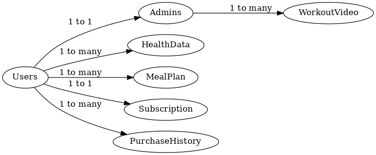

### 📁 Project Structure
```
ai-fitness-app-architecture/
├── README.md
├── database/
│   └── schema.sql
├── api/
│   └── endpoints.md
└── architecture/
    └── system_architecture.md
``` 
# AI-Powered-Fitness-App---System-Architecture
📘 README.md Template

# AI-Powered Fitness App - System Architecture
**📌 Overview**
FitCore is a cross-platform fitness app that combines AI-driven meal planning and on-demand workouts. The system consists of a React Native frontend, Django REST backend, and integration with external services like Google Fit, Apple HealthKit, and OpenAI.

**🧱 System Architecture**
Components:
```
Mobile Frontend (React Native)
Backend API (Django + DRF)
Database (PostgreSQL)
AI Meal Plan Generator (OpenAI API / custom ML model)
Media Storage (AWS S3 / Cloudinary)
Payments (Google/Apple IAP)
Analytics (custom or 3rd-party like Mixpanel)
```
```
**Diagram:**

                            +-------------------+
                            |   Mobile App (RN) |
                            +--------+----------+
                                     |
                                     | REST API Calls (HTTPS)
                                     v
                        +------------+-------------+
                        |      Django REST API     |
                        +------------+-------------+
                                     |
     +-------------------------------+-----------------------------+
     |                |                |               |           |
     v                v                v               v           v
+------------+  +-------------+  +-------------+  +------------+ +-------------+
| PostgreSQL |  | OpenAI API  |  | AWS S3 /    |  | Google Fit | | Apple Health|
|  Database  |  | or ML Model |  | Cloudinary  |  |     SDK    | |   HealthKit |
+------------+  +-------------+  +-------------+  +------------+ +-------------+
                                                             |
                                                             v
                                                    +----------------+
                                                    |  Payments (IAP |
                                                    |  + Stripe Web) |
                                                    +----------------+

```
**📂 Database Schema**
```
Main Tables:
User – Stores auth and profile info
WorkoutVideo – Workout details and video links
MealPlan – AI-generated meal plans
HealthData – Weight, sleep, activity, etc.
Subscription – Stores active plan info
PurchaseHistory – One-time content purchases
Admin – For content and user management
```

**ERD:**


**🔌 API Endpoints (Django REST Framework)**

```
Endpoint	Method	Description	Estimated Time

/api/auth/register/	POST	        Register user	                0.5 day
/api/auth/login/	POST	          Login user	                  0.5 day
/api/user/profile/	GET/PUT	      View/update profile	          0.5 day
/api/health-data/	GET/POST	      Sync or submit health data	  1 day
/api/meal-plan/	GET	              Get AI meal plan	            1.5 days
/api/meal-plan/regenerate/	POST	Regenerate meal plan	        0.5 day
/api/workouts/	GET	              List available workouts	      0.5 day
/api/workouts/<id>/	GET	          View a single workout	        0.25 day
/api/subscription/	POST	        Create/update subscription	  1 day
/api/purchase/	POST	            One-time content purchase	    0.5 day
/api/admin/content/	POST	        Upload workout/meal template	1 day
/api/admin/users/	GET	            List and manage users	        0.5 day
/api/notifications/	GET	          Get user notifications	      0.5 day
```
**Total Estimate: ~10-12 development days**

